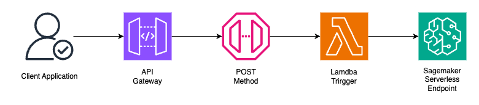

# AWS ML Inference on SageMaker with Lambda Trigger

## Desired Infrastructure



For simplicity and cost, we only setup the two rightmost ones.

## Setup

### Sagemaker Endpoint

To start developing an endpoint, we will clone our model weights from Huggingface, insert our inference code,
and tar the file as a tar archive to be uploaded to S3.

1.  Initialise Git-LFS, if you haven't already:

    ```sh
    brew install git-lfs
    sudo git-lfs install --system
    ```

2.  Clone the model. In this case, we use vit-base-patch16-384.

    ```sh
    git clone https://huggingface.co/google/vit-base-patch16-384 && \
       cd vit-base-patch16-384 && \
       rm -rf *.git
    ```

3.  Depending on your inference framework of choice, keep only the model file that is of use to shrink the size.
    As we use PyTorch, you will only need the following files:

        ```txt
        ├── config.json
        ├── preprocessor_config.json
        └── pytorch_model.bin
        ```

4.  Setup the `code` directory within this folder. This is where the inference code lives.

5.  For setup, copy these files into the `vit-base-patch16-384` folder that exists.

6.  Using the requirements.txt, setup a virtual environment and edit the `inference.py` script.

7.  Once done, the folder to upload should look like this:

    ```txt
    ├── code
    │   ├── inference.py
    │   └── requirements.txt
    ├── config.json
    ├── preprocessor_config.json
    └── pytorch_model.bin
    ```

8.  In that folder, run the command:

    ```sh
    tar -cvzf vite-base-patch16-384.tar.gz * && \
      aws s3 cp vite-base-patch16-384.tar.gz s3://ecomragdev/models/ # you may need AWS CLI authentication for this
    ```

9.  Now, go to the `deploy` folder, initialise the environment with the `requirements.txt` file and open the notebook.

10. Insert the Account ID and run the cells. DO NOT commit the account ID.

11. The model is deployed. Run the `test.sh` script to test the output. If it does not work, copy the contents and replace the argument with the
    `@/path/to/file` convention.

### Lambda Function

This function does 3 things:

1. Serialises HTTP request payloads to base64. To circumvent this and pass the data to the model which expects image binary, we need to decode the base64 body.

2. Passes the file payload to the endpoint. To invoke the endpoint, we need to configure the IAM role to allow the Lambda to invoke the endpoint.

3. Serialises the response. As the AWS SDK serialises the response (JSON string) as a byte stream, we need to convert it for JSON serialisation.

To setup, you simply need to:

1. Copy the `lambda_handler.py` code into the Lambda Function.

2. Edit the environment variable under "Configuration" to include the endpoint name of the Sagemaker Endpoint. This can be found in Console > Sagemaker > Inference > Endpoints.

3. Edit the trust policy in IAM to include the trust permissions to invoke the endpoint.

4. Deploy the function. You may invoke it either with the test.sh script, or manually via copying the `curl` command.
   This endpoint will accept image files as its payload body, and return JSON.
